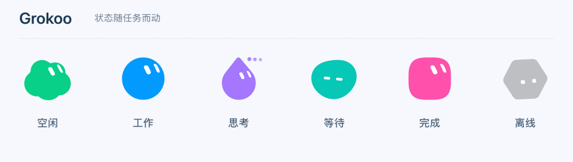

<p align="center">
  
</p>

<h1 align="center">Grokoo</h1>

<p align="center"><strong>在桌面上，看见 Bot 的工作状态。</strong></p>

<p align="center">
  Grok Bot 的 macOS 桌面伙伴<br>
  macOS 14+ &nbsp; · &nbsp; Apple Silicon / Intel &nbsp; · &nbsp; 1.1 · build 12
</p>

<p align="center">
  <a href="#开始使用">开始使用</a> &nbsp; / &nbsp;
  <a href="#桌面与-dock">桌面与 Dock</a> &nbsp; / &nbsp;
  <a href="#键盘操作">键盘操作</a> &nbsp; / &nbsp;
  <a href="#从源码构建">从源码构建</a>
</p>

<p align="center">
  
</p>

Grokoo 把 Bot 的形体、颜色和任务状态带到桌面。空闲时轻轻巡游，工作时转起彩带，完成后留在工作区，等你查看、收起。最多六只伙伴显示在普通应用后方，你也可以为 Bot 和群聊打开独立的 Dock 入口。

## 开始使用

需要 **macOS 14 或更高版本**，并在同一台 Mac 上安装、登录 Grok Bot。

1. 解压收到的应用包，把完整的 `Grokoo.app` 放进“应用程序”。只有源码时，先按[构建步骤](#从源码构建)生成应用。
2. 先打开 Grok Bot，再打开 Grokoo。首次连接时如出现钥匙串提示，按提示允许访问。
3. 点击菜单栏的 Grokoo 图标进入设置，选择桌面伙伴、MBTI 和显示顺序。
4. 需要快捷入口时，在设置下方的 **Dock 入口** 中为 Bot 或群聊打开开关。

当前应用使用本地 ad hoc 签名，尚未完成 Developer ID 签名与 Apple 公证。从网络接收后若被 macOS 拦截，可按 [Apple 的打开应用说明](https://support.apple.com/zh-cn/102445)，在“系统设置 → 隐私与安全性”中允许首次打开。升级前先退出旧的 Grokling 或 Grokoo；原有设置和完成记录会保留。

## 桌面与 Dock

| 位置 | 你能看到什么 | 如何使用 |
| :--- | :--- | :--- |
| **桌面伙伴** | Bot 自己的形体、颜色与当前状态；支持八种外形 | 在设置中选择最多六只，调整 MBTI 与顺序 |
| **底部工作区** | 正在工作的伙伴，以及保留的已完成结果 | 聚焦角色后单个收起，也可一次全部收起 |
| **Dock 入口** | 普通 Bot 的角色图标，或群聊的成员宫格 | 点击打开 Grok Bot 中的目标；右键收起完成结果或停用入口 |
| **菜单栏** | 随系统外观显示的单色品牌图标 | 打开设置、显示或隐藏伙伴、进入工作区 |
| **完成通知** | 任务结束提醒；三秒内完成的任务合并提醒 | 在设置中开启通知；等待回复不会触发通知 |

桌面和 Dock 的开关分别保存。Dock 入口默认关闭，不占六只桌面伙伴的名额；退出 Grokoo 时一同退出，下次启动按设置恢复。开启系统“减少动态效果”后，巡游与循环动作停止，状态依然可辨认。

### 状态与动作

| 空闲 | 工作 | 思考 | 等待 | 完成 | 离线 |
| :---: | :---: | :---: | :---: | :---: | :---: |
| 轻微呼吸、巡游 | 转身与彩带 | 眼神与思考点 | 安静等待回复 | 完成动作、保留结果 | 降低明度、安静停留 |

动图使用应用中的原生角色绘制。受阻动作也已实现；真实受阻状态仍需 Grok Bot Gateway 提供结构化信号，当前不会从回复内容猜测状态。

## 键盘操作

| 按键 | 操作 |
| :--- | :--- |
| <kbd>⌘</kbd> + <kbd>⌥</kbd> + <kbd>W</kbd> | 进入工作区 |
| <kbd>Tab</kbd> / <kbd>Shift</kbd> + <kbd>Tab</kbd> | 在角色和操作按钮间移动 |
| <kbd>Delete</kbd> | 收起当前聚焦的已完成结果 |
| <kbd>⌘</kbd> + <kbd>⌥</kbd> + <kbd>D</kbd> | 收起全部已完成结果 |
| <kbd>Esc</kbd> | 退出工作区焦点 |

## 数据与连接

Grokoo 通过本机 Grok Bot Gateway 处理身份与状态元数据，不保存 Prompt、回复正文、文件名或详细错误。Dock 组件接收显示所需的身份与状态，不接触 Gateway 凭据。

## 从源码构建

准备支持 **Swift 6** 的 Xcode，并安装 XcodeGen。克隆仓库后，在仓库根目录运行：

```sh
brew install xcodegen
xcodegen generate
xcodebuild -project Grokoo.xcodeproj -scheme Grokoo \
  -configuration Debug -derivedDataPath .build build
open .build/Build/Products/Debug/Grokoo.app
```

### 验证与打包

完整验证需要 `ripgrep` 和 `jq`。打包脚本会校验主程序与内置 Dock 组件的签名和双架构：

```sh
brew install ripgrep jq
./scripts/verify.sh
./scripts/package.sh
```

输出位于 `dist/`：`Grokoo-1.1-12-macOS.zip` 与对应的 `.sha256` 文件。压缩包包含完整应用，支持 Apple Silicon 和 Intel。

<details>
<summary><strong>开发检查与素材再生成</strong></summary>

单独运行自动检查：

```sh
xcodegen generate
xcodebuild -project Grokoo.xcodeproj -scheme Grokoo \
  -configuration Debug -destination 'platform=macOS' \
  -derivedDataPath .build CODE_SIGNING_ALLOWED=NO test
```

Debug 构建提供 Experience Check，可在“工作区”菜单切换布局与状态。“原生动作检查…”支持查看八种外形与七种状态、切换 32/42pt、减少动态、播放或拖动时间，以及导出原生矩阵。

```sh
open -n --env GROKOO_EXPERIENCE_FIXTURE=idle \
  --env GROKOO_MOTION_EXPERIENCE=1 \
  .build/Build/Products/Debug/Grokoo.app
```

正常构建直接使用仓库中的原生几何数据和参考文件，无需外部素材包。维护者需要重新生成时，须自行提供对应的 `grokling-animation-kit`，通过显式路径运行；两脚本还需要 Python 3 与支持 `--experimental-transform-types` 的 Node.js：

```sh
python3 scripts/generate-native-motion-data.py --kit /path/to/grokling-animation-kit
python3 scripts/generate-native-motion-reference.py --kit /path/to/grokling-animation-kit
```

生成的 Xcode 工程、构建产物、场景验收输出和本地资料不进入版本库。

</details>

## 当前版本

**1.1 · build 12** 包含原生角色动作、桌面工作区、完成结果收起、独立 Dock 入口，以及统一的 App Icon 与 18pt 菜单栏 Template。

<details>
<summary><strong>验证范围与剩余工作</strong></summary>

- 整合回归 155 项通过；末轮渲染优化后，针对检查再次通过，228 张固定动作图与优化前逐字节一致。
- 主程序与 Dock 组件的 Apple Silicon / Intel 构建、签名校验和压缩包解压核验通过。
- 六只空闲角色的最终测量平均 CPU 约 3.1%，物理 footprint 约 37 MB、RSS 约 116 MB；空闲 CPU 低于 2% 的目标仍未达到。
- Dock 多入口的系统外观、真实群聊点击定位、部分通知与辅助功能，以及跨机器首次安装仍待实机验收。群聊会话地址已核对 Grok Bot 0.53.0 的路由实现。
- 16 人格配件继续暂缓；新巡游路线、人格演化、桌面独白和锤子互动仍保留在独立方案或原型中。

</details>

---

第三方代码来源与许可证见 [THIRD_PARTY_NOTICES.md](THIRD_PARTY_NOTICES.md)。
